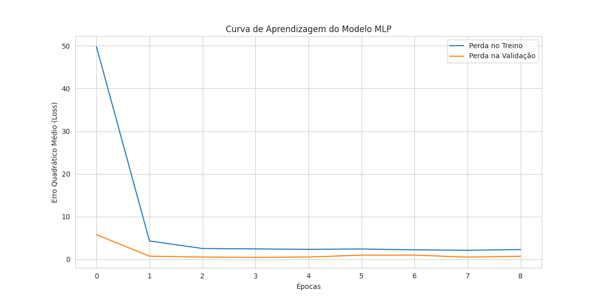
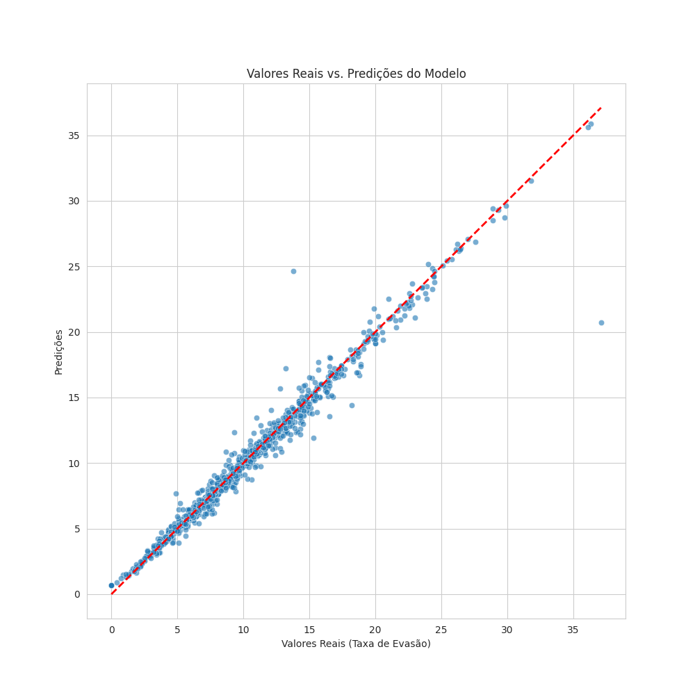
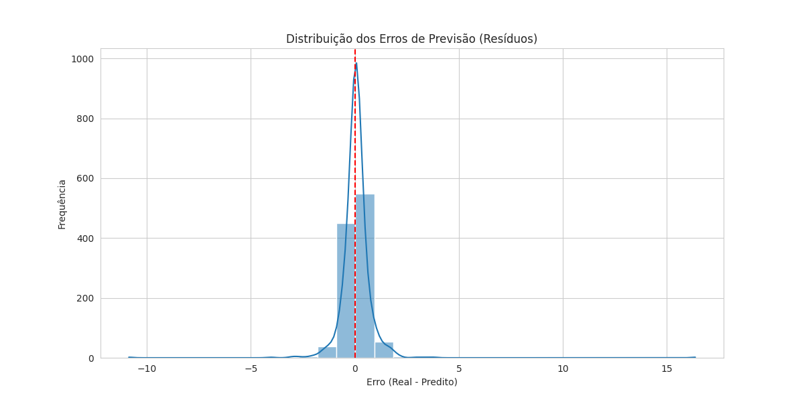
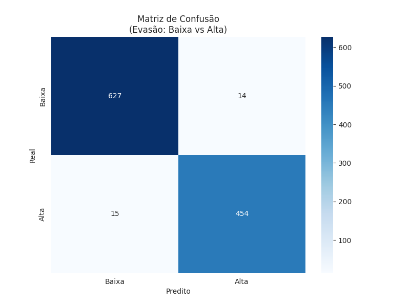
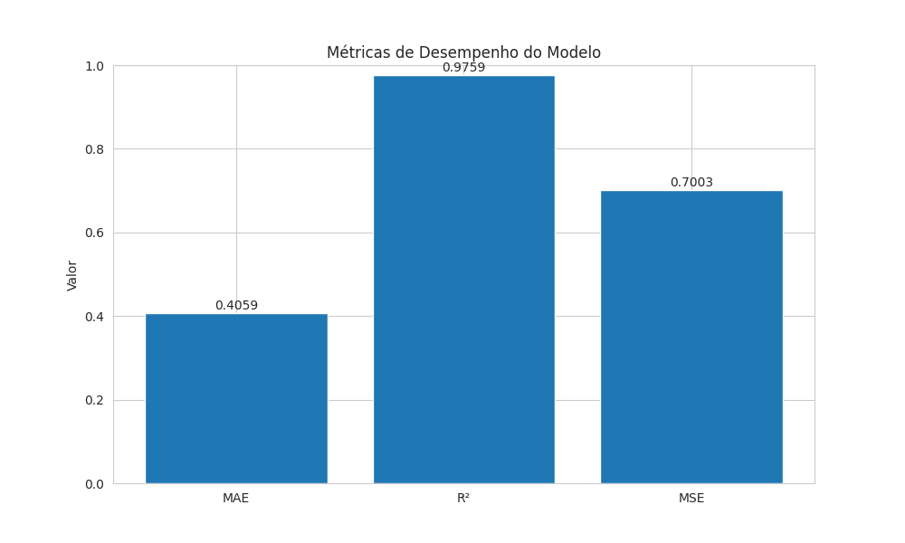

# Previsão da taxa de evasão de alunos do ensino médio a nível municipal usando aprendizado de máquina

## 📊 Sobre o Projeto
Este projeto analisa as taxas de evasão escolar no Ensino Médio público brasileiro, utilizando dados de 2021-2022. O objetivo é prever a taxa total de evasão com base nas taxas de cada ano do Ensino Médio, utilizando técnicas de Machine Learning.

## 🎯 Funcionalidades
- Carregamento e pré-processamento de dados educacionais
- Análise preditiva usando Redes Neurais (MLP)
- Visualizações detalhadas dos resultados
- Avaliação de métricas de performance

## 📁 Estrutura do Projeto
```
analise_ensino_medio_rp2/
├── src/
│   ├── data/
│   │   ├── __init__.py
│   │   └── loader.py
│   ├── models/
│   │   ├── __init__.py
│   │   └── mlp_model.py
│   └── visualization/
│       ├── __init__.py
│       └── plots.py
├── main.py
└── README.md
```

## 🔧 Requisitos
- Python 3.x
- pandas
- numpy
- scikit-learn
- tensorflow
- matplotlib
- seaborn

## 📥 Instalação
```bash
git clone [url-do-repositorio]
cd analise_ensino_medio_rp2
pip install -r requirements.txt
```

## 🚀 Como Usar
1. Certifique-se de que o arquivo de dados `TX_TRANSICAO_MUNICIPIOS_2021_2022.xlsx` está na raiz do projeto
2. Execute o programa principal:
```bash
python main.py
```

## 📈 Dados
O projeto utiliza dados do INEP sobre transição escolar, considerando:
- Taxa de evasão do 1º ano do EM
- Taxa de evasão do 2º ano do EM
- Taxa de evasão do 3º ano do EM
- Taxa total de evasão do EM

## 🔍 Metodologia
1. **Pré-processamento:**
   - Filtragem de dados para escolas públicas
   - Tratamento de valores ausentes
   - Normalização dos dados

2. **Modelagem:**
   - Rede Neural MLP (Multi-Layer Perceptron)
   - Divisão treino/teste: 80%/20%
   - Otimização com Early Stopping

3. **Avaliação:**
   - MAE (Erro Médio Absoluto)
   - MSE (Erro Quadrático Médio)
   - R² (Coeficiente de Determinação)
   - Matriz de Confusão Adaptada

## 📊 Visualizações Geradas
### Curva de Aprendizagem

### Predições vs. Valores Reais

### Distribuição dos Erros

### Matriz de Confusão

### Métricas de Performance


## 👥 Contribuição
Sinta-se à vontade para contribuir com o projeto através de Pull Requests ou reportando issues.

## 📝 Licença
Este projeto está sob a licença [inserir tipo de licença].